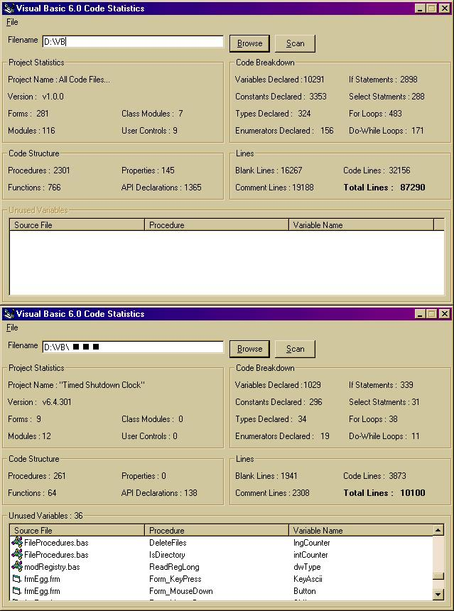



## Code Statistics and Unused Variable Finder v4\.2

### Description

This will get the statistics for your code, from the amount of commented lines, variables declared, api declarations made, If statements used, For loops used to how many forms, modules, classes or user controls are in your project. The main update from last time is a more accurate scanner, new display for the unused variables with appropiate iconic representation of where they are and a new feature: scan an entire directory and all sub-directories for vb code. Find out how much code you have written! Any votes and/or suggestions for improvements are very welcome - I do put them in and I do update with fixes, so don't hesitate in posting :) Thank you!
 
### More Info
 

             |
---                |---
**Submitted On**   |2002-07-18 21:23:04
**By**             |[Eric O'Sullivan](https://github.com/Planet-Source-Code/PSCIndex/blob/master/ByAuthor/eric-o-sullivan.md)
**Level**          |Advanced
**User Rating**    |4.8 (86 globes from 18 users)
**Compatibility**  |VB 6\.0
**Category**       |[Coding Standards](https://github.com/Planet-Source-Code/PSCIndex/blob/master/ByCategory/coding-standards__1-43.md)
**World**          |[Visual Basic](https://github.com/Planet-Source-Code/PSCIndex/blob/master/ByWorld/visual-basic.md)
**Archive File**   |[Code\_Stati1078307182002\.zip](https://github.com/Planet-Source-Code/eric-o-sullivan-code-statistics-and-unused-variable-finder-v4-2__1-36999/archive/master.zip)

